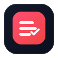

# YouTube Subscriptions Manager (Static Web)

<p>
  
</p>

Read this in: **English** | [한국어](README.ko.md) | [日本語](README.ja.md)

A **static web app** that helps you back up and reorganize your **subscribed YouTube channels**.

Core features:
- Show **how many channels you’re subscribed to**
- **Export** your subscribed channels to a file (JSON/CSV)
- **Cleanup**: export first, then unsubscribe from all (requires explicit typed confirmation)
- **Import** an edited export file and subscribe to missing channels from the browser

The UI supports **Korean / English / Japanese** and defaults to your browser language (you can override it from the language selector).

## Tech
- Vite + TypeScript
- Google OAuth via **Google Identity Services (GIS) Token Client**
- YouTube Data API v3

## Legal (required for Google OAuth verification)
- Privacy Policy: `privacy.html`
- Terms of Service: `terms.html`

When deployed (e.g. GitHub Pages project site), these are typically:
- `https://<your-domain>/<your-path>/privacy.html`
- `https://<your-domain>/<your-path>/terms.html`

## Local development

```bash
npm install
npm run dev
```

This web app expects a build-time env var:

- `VITE_GOOGLE_OAUTH_CLIENT_ID`

For local development, set it before running Vite:

```bash
export VITE_GOOGLE_OAUTH_CLIENT_ID="xxxxxxxxxxxx-xxxxxxxxxxxxxxxxxxxxxxxxxxxx.apps.googleusercontent.com"
npm run dev
```

Then open the URL printed by Vite.

Build:

```bash
npm run build
```

Preview the production build:

```bash
npm run preview
```

## Google Cloud setup (required)

You need your own Google Cloud project and OAuth Client ID.

1) **Enable API**
- In Google Cloud Console, enable **YouTube Data API v3**.

2) **Create OAuth Client ID**
- Create an OAuth client of type **Web application**.
- Add your local/dev and production origins to **Authorized JavaScript origins**.
  - Examples: `http://localhost:5173`, your deployed domain.

3) **Configure the Client ID**
- Set `VITE_GOOGLE_OAUTH_CLIENT_ID` as a build-time environment variable.
- For GitHub Pages deploy, add a GitHub Actions secret named `VITE_GOOGLE_OAUTH_CLIENT_ID` (the workflow injects it during `npm run build`).

## OAuth scopes
- Read-only operations use:
  - `https://www.googleapis.com/auth/youtube.readonly`
- Subscription changes (unsubscribe/subscribe) use:
  - `https://www.googleapis.com/auth/youtube`

## OAuth Security
This app implements OAuth best practices for security:
- **State parameter**: A cryptographically random state parameter is generated for each OAuth request to prevent CSRF attacks and session fixation
- **State validation**: The state is validated when the OAuth callback returns, rejecting mismatched or missing states
- **Session storage**: State values are stored in `sessionStorage` (tab-scoped) and consumed once after validation
- **Secure random generation**: Uses `crypto.getRandomValues()` with 256 bits of entropy for unpredictable state values

## Import format

### JSON (recommended)
The app’s JSON export includes `channelId` per entry. Import expects `channelId` (or a URL containing `/channel/<id>`).

### CSV
CSV should include at least a `channelId` column.

## Notes / safety
- **Unsubscribe/Subscribe actions change your real account immediately.** Always export a backup first.
- Large subscription lists may hit quota/rate limits; the app uses backoff and pacing but failures can still happen.

## Support
If this app helped you, consider supporting the project:
- `https://buymeacoffee.com/e3pbwto`

## Project structure
- `index.html` — main page
- `src/web/` — web app (OAuth, i18n, UI logic)
- `src/shared/` — shared utilities/types
